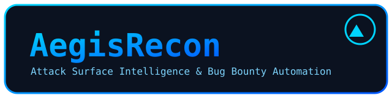

<p align="center">
  
</p>

<h1 align="center">AegisRecon</h1>

<p align="center">
  <strong>Enterprise-grade Attack Surface Intelligence &amp; Bug Bounty Automation Framework</strong>
</p>

<p align="center">
  <a href="https://www.python.org/downloads/"></a>
  <a href="LICENSE"></a>
  <a href="https://github.com/aegisrecon/aegisrecon/actions"></a>
  <a href="https://github.com/aegisrecon/aegisrecon/releases"></a>
  
</p>

---

**AegisRecon automates everything *surrounding* manual hacking** — reconnaissance,
attack-surface mapping, asset tracking, change monitoring, and reporting — so
security researchers spend their time finding vulnerabilities instead of
collecting data.

> This project does **not** automate hacking, exploitation, or mass scanning.
> It is a platform for **authorized** bug bounty and penetration testing
> engagements, with scope enforcement built in at every layer.

## Highlights

- 🔭 **Modular, plugin-driven architecture** — recon providers, scanners,
  notifiers and exporters plug in without touching core code.
- 🛡️ **Scope-first safety** — every discovered asset passes through an
  explicit, deny-by-default scope validator before it is stored or probed.
- ⚡ **Fast by design** — bounded parallelism, retries with backoff, resumable
  and incremental persistence.
- 🗄️ **Product-grade database** — SQLite (WAL), UUID keys, audit timestamps,
  full entity model: programs, scope, assets, DNS, IPs, endpoints,
  technologies, findings, reports.
- 🎨 **Beautiful CLI** — Typer + Rich: colored tables, progress bars, panels.
- 📦 **Runs anywhere** — Kali, Ubuntu, Debian, Parrot, macOS, Windows WSL.
- 🔌 **ProjectDiscovery-native** — first-class integration with `httpx`, `subfinder`, `naabu`, `katana`, `dnsx`, and `nuclei`, plus `gitleaks` for secrets — all offloaded to fast Go binaries where possible.

## Quick start

```bash
python3 -m venv .venv && source .venv/bin/activate
pip install -e ".[dev]"

aegisrecon init
aegisrecon program create "My Program" --org "Acme Inc"
aegisrecon scope add "My Program" example.com --wildcard
aegisrecon recon run "My Program"          # passive CT logs + DNS resolution
aegisrecon report json "My Program"
```

Full installation and Kali-specific instructions: [docs/INSTALL.md](docs/INSTALL.md).

## Example workflow

```text
$ aegisrecon program create "Acme" --org "Acme Inc"
✔ Created program Acme (id: 3a49ac7b-...)

$ aegisrecon scope add Acme example.com --wildcard
✔ Added INCLUDE rule *.example.com (wildcard) to Acme

$ aegisrecon recon run Acme
┌────────────────────────────────────┐
│ Recon complete                     │
│  Candidates discovered : 342       │
│  In scope             : 318        │
│  Resolved             : 251        │
│  New assets           : 251        │
│  DNS records stored   : 412        │
│  IP records stored    : 330        │
└────────────────────────────────────┘
```

## Command reference

| Command | Purpose |
| --- | --- |
| `aegisrecon init` | Create state directory, schema, defaults |
| `aegisrecon program create/list/show` | Manage engagement programs |
| `aegisrecon scope add/list/remove` | Authorize in/out-of-scope rules |
| `aegisrecon recon run` | Passive discovery + DNS resolution (`--resume` resumes an interrupted scan) |
| `aegisrecon recon ingest <file>` | Import externally-discovered hostnames |
| `aegisrecon probe run` | Probe assets with `httpx`, extract endpoints + parameters |
| `aegisrecon harvest js` | Harvest JavaScript files with `katana` |
| `aegisrecon secrets scan/list` | Detect and review leaked secrets in stored files |
| `aegisrecon secrets scan-repo <dir>` | Scan a git repo / dir with the Go `gitleaks` binary |
| `aegisrecon ports scan` | Discover open ports with `naabu` |
| `aegisrecon vuln run` | Scan endpoints for vulnerabilities with `nuclei` |
| `aegisrecon screenshot run` | Capture screenshots of live endpoints |
| `aegisrecon monitor run` | Snapshot state and detect changes over time |
| `aegisrecon schedule add/list/run` | Manage recurring scheduled workflows |
| `aegisrecon notify list/test` | Deliver notifications (Slack, Discord, console) |
| `aegisrecon asset list` | List discovered assets (`--show-aliases`) |
| `aegisrecon asset alias add` | Bind a variant hostname as an alias of a canonical asset |
| `aegisrecon asset dedup` | Merge duplicate assets, reparent child records |
| `aegisrecon finding list/set-status` | Query and triage findings |
| `aegisrecon report json` | Versioned JSON engagement report |
| `aegisrecon report markdown` | Human-readable executive Markdown report |
| `aegisrecon report dashboard` | Self-contained dark-mode HTML dashboard |
| `aegisrecon suggest run` | Context-aware manual-testing suggestions |
| `aegisrecon collab add/list/remove` | Manage program collaborators & roles |
| `aegisrecon plugin list/scaffold/install` | Discover, create and install plugins |
| `aegisrecon api serve` | Run the REST API + dashboard server (`[api]` extra) |
| `aegisrecon config show` | Print effective configuration |

Every command supports `--data-dir` to override state location and `--debug`/`-v`.

## Architecture

```
CLI  →  Program Manager  →  Scope Validator  →  Recon Engine
                                                  ├─ Passive providers (CT logs)
                                                  ├─ DNS resolution (parallel)
                                                  └─ ProjectDiscovery httpx
Asset Database  →  Reporting  →  JSON deliverables
```

See [docs/architecture/overview.md](docs/architecture/overview.md) and
[ARCHITECTURE.md](ARCHITECTURE.md) for the full design.

## Documentation

- [Installation (Kali/Ubuntu/macOS/WSL)](docs/INSTALL.md)
- [Architecture overview](docs/architecture/overview.md)
- [Database schema](docs/architecture/database.md)
- [Scope & safety model](docs/architecture/scope.md)
- [CLI reference](docs/cli/reference.md)
- [Plugin development](docs/architecture/plugins.md)

## Roadmap

Foundation, attack-surface intelligence, monitoring and automation are live
today, along with manual-testing suggestions, REST API, an offline dashboard,
team collaboration and a plugin registry. Up next: AI-assisted triage (never
verdicts). See [ROADMAP.md](ROADMAP.md).

## Contributing

Contributions are welcome — see [CONTRIBUTING.md](CONTRIBUTING.md). This
project follows a [Code of Conduct](CODE_OF_CONDUCT.md). Security issues are
handled privately — see [SECURITY.md](SECURITY.md).

## License

Apache-2.0. See [LICENSE](LICENSE).
